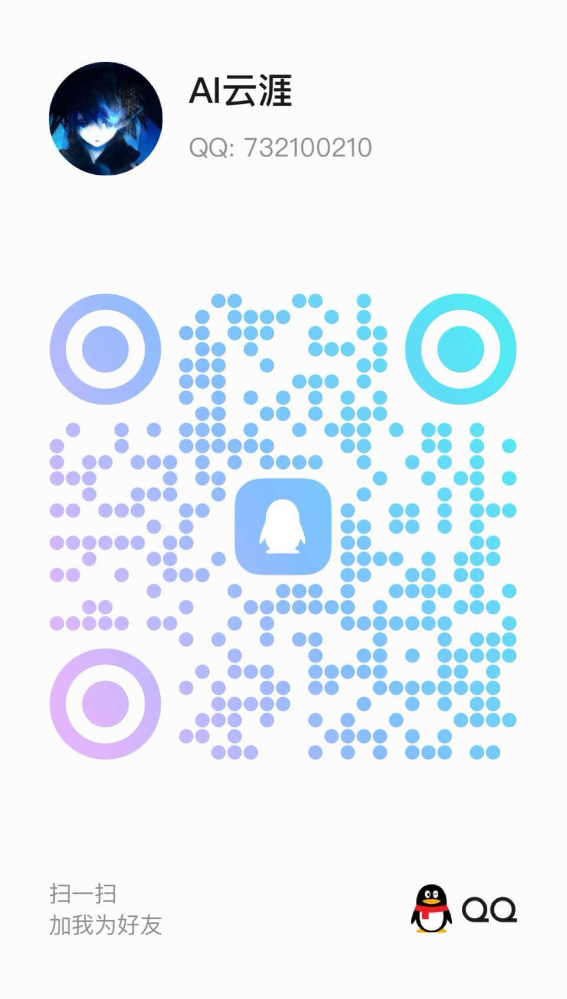

# YunyaClaw

<p align="center">
  <strong>基于 Electron 封装的 OpenClaw 个人 AI 助手桌面应用</strong>
</p>

<p align="center">
  <a href="LICENSE"></a>
</p>

YunyaClaw 是一款 Windows 桌面应用，将 [OpenClaw](https://github.com/openclaw/openclaw) 核心引擎封装为开箱即用的便携式应用。内置 Node.js 运行时，目标机器无需单独安装 Node，双击即可运行。

## 特性

- **开箱即用**：内置 Node.js 22 与 OpenClaw 发行产物，无需额外安装
- **可自定义外观**：支持修改应用名称和应用图标，在设置页即可配置
- **便携式打包**：支持 NSIS 安装包，可自定义安装目录
- **多模型支持**：百炼、DeepSeek、智谱等国内模型，配置 API Key 即可使用
- **内置集成**：QQ 机器人、钉钉连接器等插件预打包，按需启用
- **配置统一**：配置与数据存放在 `~/.openclaw/`，与 OpenClaw 生态兼容

## 环境要求

- **开发**：Node.js 22+，pnpm
- **运行**：Windows 10/11 x64（打包后无需 Node）

## 快速开始

### 安装依赖

```bash
pnpm install
```

### 开发模式

```bash
pnpm dev
```

开发模式会自动 bundle 内置插件，并启动 Electron 与 Vite 热更新。

### 构建 Windows 便携版

```bash
pnpm build:win-mini
```

默认使用 `build:win-mini`（精简版 openclaw 发行产物，体积更小）。完整版可用 `pnpm build:win`。

输出目录为 `release-yyyyMMddhhmm/`，包含安装包与便携资源。若遇占用锁定，可先执行：

```bash
pnpm kill-release-lock
```

## 项目结构

```
yunya-claw/
├── electron/           # Electron 主进程
│   ├── main.ts         # 窗口、Gateway 子进程、IPC
│   └── preload.ts      # 渲染进程 API（electronAPI）
├── src/                # React 前端
│   ├── pages/          # 设置、模型、集成、聊天等页面
│   ├── components/     # UI 组件
│   └── contexts/       # Gateway、Agent 等 Context
├── openclaw/            # OpenClaw 核心（git submodule）
├── resources/           # 打包资源
│   ├── bundled-plugins/ # 预打包插件
│   ├── bundled-skills/  # 预打包技能
│   └── openclaw-release/ # 构建时生成的 openclaw 发行产物
└── scripts/            # 构建脚本
```

## 配置说明

- **主配置**：`~/.openclaw/openclaw.json`（OpenClaw 标准格式）
- **应用配置**：`~/.openclaw/yunyaClaw.json`（外观、Provider 启用状态等）
- **环境变量**：`~/.openclaw/.env`（API Key、代理等，可在设置页编辑）

### 自定义应用名称与图标

在应用内 **设置 → 应用外观** 中可修改：
- **应用名称**：窗口标题、任务栏显示名称
- **应用图标**：支持上传 PNG/JPG 自定义图标，修改后立即生效

## 调试

设置环境变量 `OPENCLAW_DEBUG=1` 可启用 DevTools 和详细日志。

## 依赖

- [OpenClaw](https://github.com/openclaw/openclaw) 作为 git submodule 引入，构建时需先初始化并更新子模块
- 内置插件：`@sliverp/qqbot`、`@dingtalk-real-ai/dingtalk-connector`

## 许可证

[MIT](LICENSE)

## 开源到 GitHub

1. 在 GitHub 创建新仓库（如 `your-username/yunya-claw`）
2. 将 `package.json` 中的 `repository`、`homepage`、`bugs` 里的 `your-username` 替换为你的 GitHub 用户名
3. 初始化并推送：

```bash
git submodule update --init
git remote add origin https://github.com/your-username/yunya-claw.git
git push -u origin master
```

## 联系作者

使用过程中如有疑问，可添加作者微信加入「使用交流群」，一起聊聊配置、使用技巧和踩坑经验。

<table>
<tr>
<td width="33%" align="center">
<br/>
<sub>微信 · 扫一扫加我为朋友</sub>
</td>
<td width="33%" align="center">
<br/>
<sub>QQ: 732100210 · 扫一扫加我为好友</sub>
</td>
<td width="33%" align="center">
<br/>
<sub>飞书 · 扫描二维码添加我为联系人</sub>
</td>
</tr>
</table>

<p align="center">
  <sub>powered by <a href="https://agiyiya.com" target="_blank">agiyiya.com</a></sub>
</p>

## 致谢

- [OpenClaw](https://github.com/openclaw/openclaw) - 个人 AI 助手核心引擎
- [Electron](https://www.electronjs.org/) - 跨平台桌面应用框架
