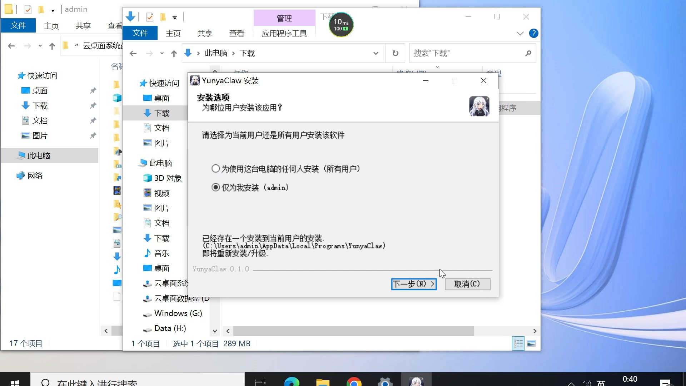
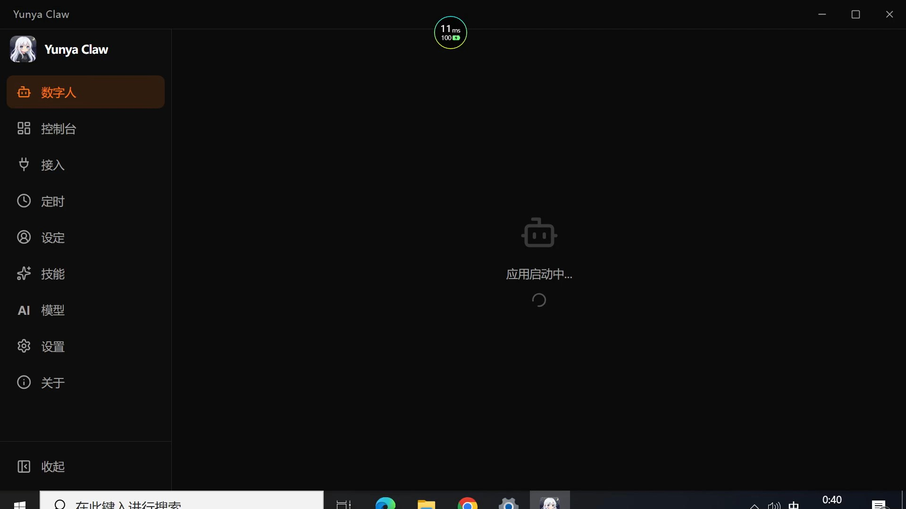
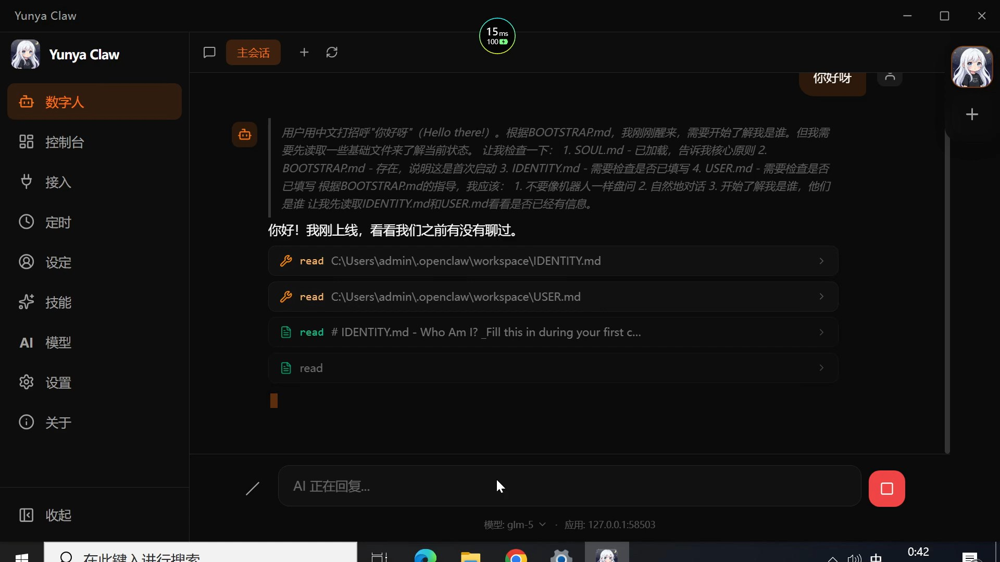
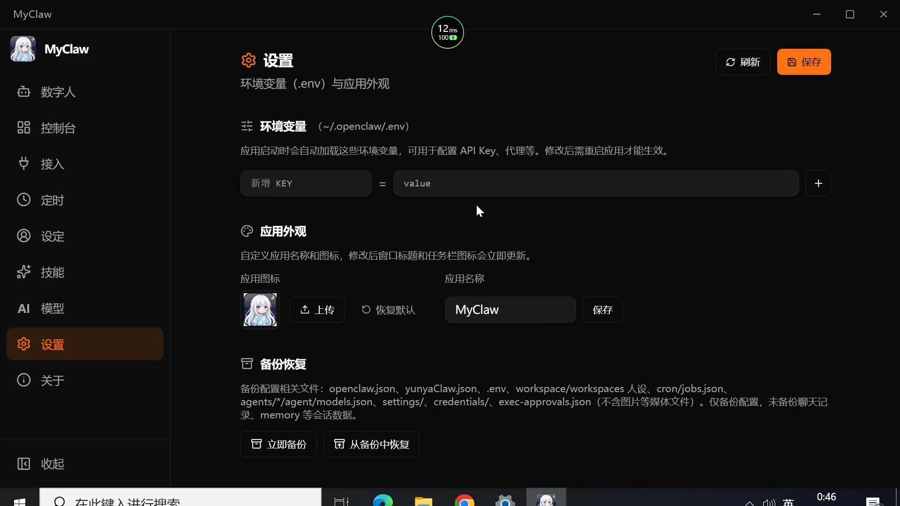
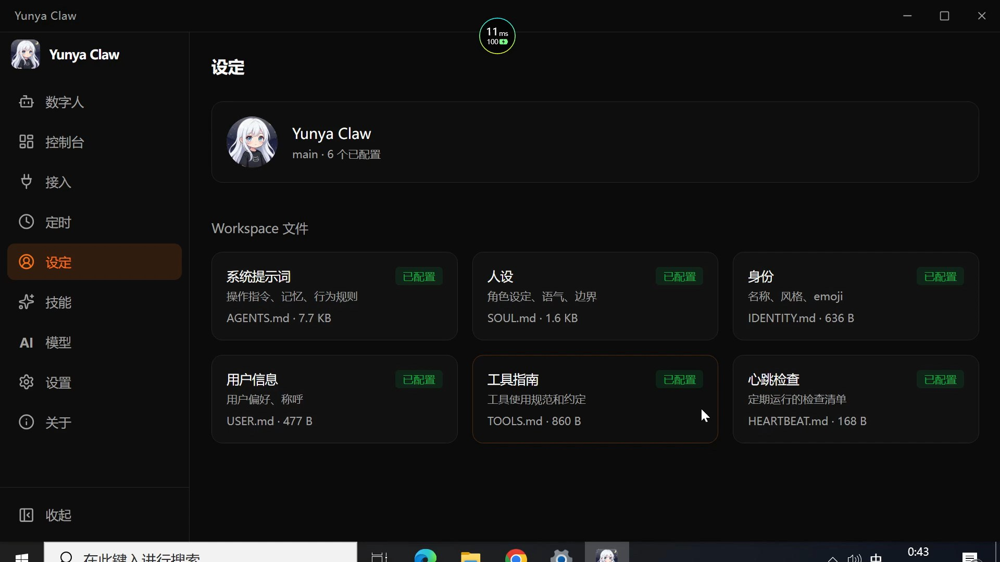
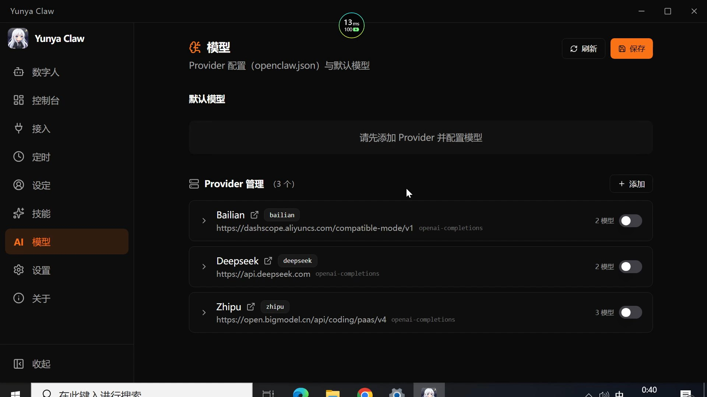
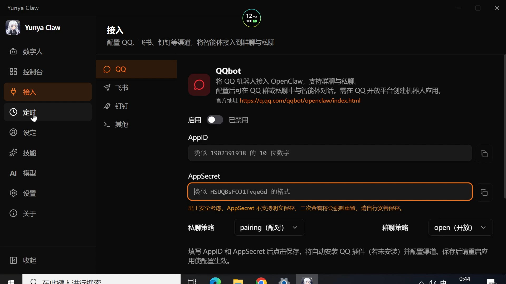
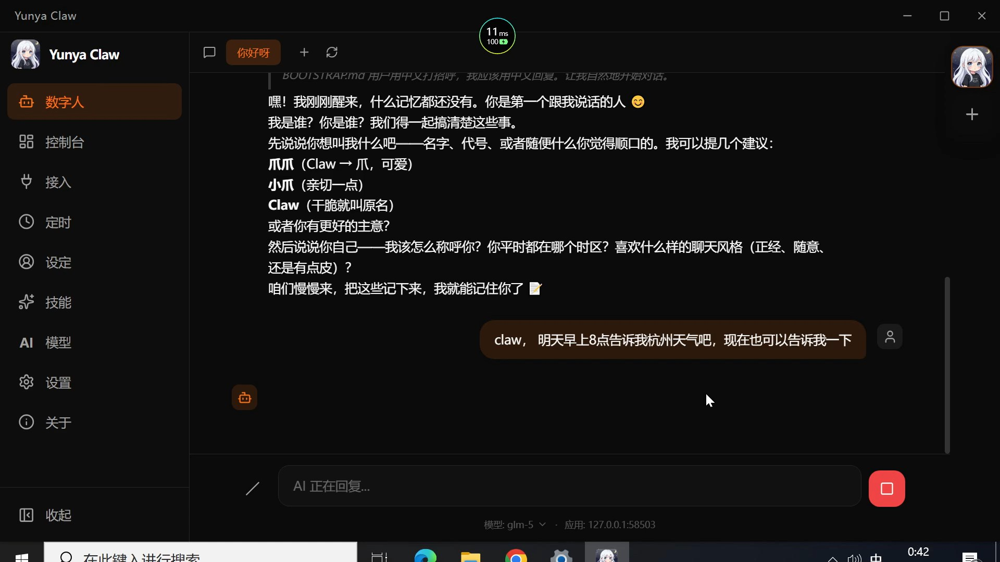
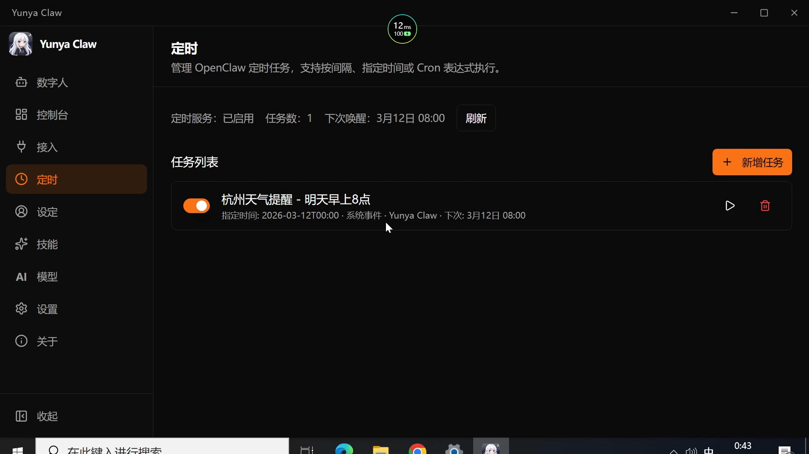
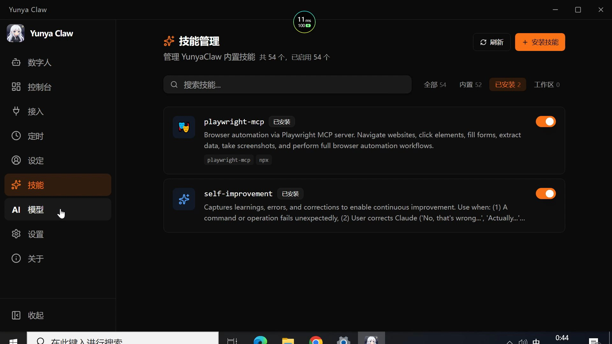

# 一个双击就能用的AI助手，还能完全自定义

**语芯说：好的AI工具，不应该把普通人挡在门外。**

---

你有没有过这种经历？

看到一个很酷的AI项目，兴冲冲地去GitHub clone下来，然后——

"请先安装Node.js 18+"

"请配置Python 3.11环境"

"请运行npm install（报错了？请检查你的node-gyp编译环境）"

然后你对着命令行发了半小时呆，默默关掉了终端。

我太懂这种感觉了。

---

---

## 所以我做了一件事

我把一个开源的AI助手框架 OpenClaw，打包成了一个**双击就能用**的桌面应用。

名字叫 **Yunya Claw**。

不需要装Node.js，不需要碰命令行，不需要配环境变量。

下载 → 双击安装 → 打开就用。

就这么简单。

---

---

## 它能干什么？

先说核心：**这是一个个人AI助手。**

你可以跟它聊天，让它帮你写东西、查资料、做分析。

但它跟市面上那些AI聊天工具最大的区别是——**你可以完全自定义它是谁。**

---

---

## 自定义到什么程度？

### 改名字，改头像，改到你认不出来

打开设置页面，你可以：
- 给应用换一个**你自己的名字**——窗口标题、任务栏图标全部实时更新
- 给应用换一个**你自己的头像**——上传一张图，立刻生效

比如你可以把它改成"MyClaw"，配上你喜欢的二次元头像。

或者改成你公司的名字，配上公司logo，直接变成你的"企业AI助手"。

改完之后，**从里到外看不出任何Yunya Claw的痕迹**。

它就是你的应用。

---

---

### 设定它的"灵魂"

在设定页面，有6个可编辑的文件，分别控制你的AI助手的不同层面：

- **系统提示词（AGENTS.md）**：操作指令、记忆、行为规则
- **人设（SOUL.md）**：角色设定、语气、边界
- **身份（IDENTITY.md）**：名称、风格、emoji偏好
- **用户信息（USER.md）**：你的偏好、称呼
- **工具指南（TOOLS.md）**：工具使用规范和约定
- **心跳检查（HEARTBEAT.md）**：定期运行的检查清单

这意味着什么？

**意味着你可以造出一个完全属于你自己的AI人格。**

不是在对话框里加一句"你是一个XX助手"那种简单的prompt，而是从灵魂到行为的完整定义。

---

---

## 国产大模型，开箱即用

这是我特别在意的一点。

很多AI工具默认只支持OpenAI，用起来要么需要科学上网，要么API价格劝退。

Yunya Claw **内置了三个国产大模型服务商的配置**：

- **百炼（阿里云DashScope）**：通义千问系列，支持百万token上下文
- **DeepSeek（深度求索）**：性价比之王，推理能力强
- **智谱（GLM系列）**：多模态支持，能看图能推理

填个API Key就能用，不需要自己配URL、配协议、配参数。

当然，如果你有其他模型服务（OpenAI、Anthropic、Ollama本地模型），也完全支持自行添加。

---

---

## 不只是聊天，还能接入你的社交平台

这个功能说实话我觉得是真正的杀手锏。

在"接入"页面，你可以把AI助手**直接接到你的社交渠道**：

- **QQ**：群聊和私聊都支持
- **飞书**：企业级协作平台
- **钉钉**：办公场景直接用

配置过程也很简单：填上对应平台的AppID和AppSecret，保存，重启，搞定。

一个人就能搭一个跑在QQ群里的AI机器人。

以前这种事要写代码、部署服务器、搞一堆运维。现在呢？点点鼠标就行。

---

---

## 定时任务：让AI自己干活

还有一个我很喜欢的功能：**定时任务。**

你可以设定一个cron表达式，让AI按计划自动执行任务。

比如：
- 每天早上8点让它给你总结一下今日新闻
- 每周五下午帮你整理本周的工作汇报
- 每隔6小时检查一次某个网站的状态

AI不再是你问一句它答一句的被动工具，而是一个**可以主动干活的助手**。

---

---

---

## 技能系统：给AI装"插件"

在技能页面，你可以管理AI助手的各种能力插件。

这些技能让你的AI助手不再只会聊天，而是真正能**执行操作、调用工具、完成复杂任务**。

---

---

## 为什么不直接用ChatGPT？

这是每个人都会问的问题。

答案很简单：

**ChatGPT是别人的AI，Yunya Claw可以变成你自己的AI。**

| | ChatGPT | Yunya Claw |
|---|---|---|
| 自定义名称和头像 | 不行 | 随便改 |
| 自定义人格和灵魂设定 | 有限 | 完全控制 |
| 国产大模型支持 | 不支持 | 开箱即用 |
| 接入QQ/飞书/钉钉 | 不行 | 原生支持 |
| 定时自动执行任务 | 不行 | 支持cron |
| 数据存储位置 | 云端 | 你的电脑 |
| 白标/企业定制 | 不行 | 完全支持 |

不是说ChatGPT不好，而是它永远是OpenAI的产品。

而Yunya Claw装完之后，**它是你的产品**。

---

## 安装到底有多简单？

我再说一遍，因为这真的是核心卖点：

**第一步**：下载安装包（大约289MB）

**第二步**：双击运行安装程序

**第三步**：选择安装路径，点下一步

**第四步**：完成。打开应用。

没有第五步了。

Node.js运行环境已经内置在安装包里了。不需要你装任何前置依赖。

我见过太多优秀的开源项目，因为安装门槛太高，把99%的普通用户挡在了门外。

所以我做Yunya Claw的第一原则就是：**普通人也能用。**

---

## 关于隐私

所有数据都存在你自己的电脑上，路径是 `~/.openclaw/`。

没有云端同步，没有数据上传，没有匿名统计。

你的对话、你的设定、你的API Key，全部在本地。

当然，这也意味着你需要自己做好备份。好在应用里内置了一键备份和恢复功能，点一下就能把所有配置打包保存。

---

## 写在最后

我一直觉得，AI应用不应该只是给技术人员用的。

一个好的AI工具，应该像一个好的消费品——**拆开包装就能用，用着用着就离不开**。

Yunya Claw还在早期阶段，功能还在迭代，还有很多粗糙的地方。

但有一件事我很确定：

**让每个人都能拥有一个完全属于自己的AI助手，这件事值得做。**

如果你感兴趣，项目是开源的（MIT协议），欢迎来GitHub看看：

https://github.com/AnyaReese/yunya-claw

---

**语芯问：如果你可以完全自定义一个AI助手，你最想让它帮你做什么？**

*作者：语芯 | AI科技内容创作者*
*2026年3月12日*
